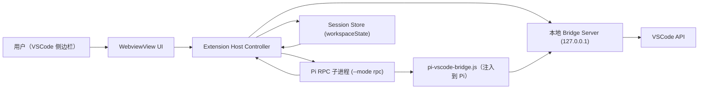

# Pi VSCode 侧边栏扩展设计文档

## 1. 文档目标

本文档用于指导从零新建一个 VSCode 扩展项目，实现“以侧边栏为主交互”的 Pi 智能体体验（接近 Codex/Claude 类插件），并且复用现有 `pi` 与 `pi-vscode` 的成熟能力，避免重复造轮子。

目标是：即使没有当前会话上下文，只凭本文档和配套开发文档，也能稳定实现同一套功能与架构。

## 2. 基线与可追溯锚点

### 2.1 代码基线（必须锁定）

- `pi` 仓库：`E:\github\pi`
- `pi` 基线提交：`fc51a40d02256e892053f7edd0810bd1f0325b0b`
- `pi-vscode` 仓库：`E:\github\pi-vscode`
- `pi-vscode` 基线提交：`8761b3ccf99bf5b7bc7e3631c508e1dd164b0e2c`

### 2.2 关键版本

- `@earendil-works/pi-coding-agent`：`0.75.5`
- Node 引擎（pi 侧）：`>=22.19.0`
- VSCode 扩展 API（pi-vscode 当前）：`^1.110.0`

### 2.3 必读源码清单（事实来源）

#### Pi 核心（RPC 与会话）

- `E:\github\pi\packages\coding-agent\src\main.ts`
- `E:\github\pi\packages\coding-agent\src\modes\rpc\rpc-mode.ts`
- `E:\github\pi\packages\coding-agent\src\modes\rpc\rpc-types.ts`
- `E:\github\pi\packages\coding-agent\src\modes\rpc\rpc-client.ts`
- `E:\github\pi\packages\coding-agent\src\core\agent-session-runtime.ts`
- `E:\github\pi\packages\agent\src\types.ts`

#### pi-vscode 可借鉴实现

- `E:\github\pi-vscode\src\extension.ts`
- `E:\github\pi-vscode\src\pi.ts`
- `E:\github\pi-vscode\src\bridge\server.ts`
- `E:\github\pi-vscode\src\bridge\handlers.ts`
- `E:\github\pi-vscode\src\bridge\serialize.ts`
- `E:\github\pi-vscode\src\bridge\state.ts`
- `E:\github\pi-vscode\src\sessions.ts`
- `E:\github\pi-vscode\bridge\pi-vscode-bridge.js`
- `E:\github\pi-vscode\package.json`

## 3. 需求定义

## 3.1 功能目标（必须有）

1. 在 VSCode 侧边栏提供主聊天界面（而不是新开编辑器页/终端页作为主入口）。
2. 通过 Pi RPC 模式驱动智能体会话，支持流式输出。
3. 显示工具调用生命周期（start/update/end）与结果摘要。
4. 支持会话创建、恢复、切换、命名、导出。
5. 支持取消当前运行（abort）。
6. 支持模型选择、thinking level 切换、可用模型查询。
7. 支持 VSCode IDE bridge（读取选择区、诊断、符号、应用编辑、格式化等）。
8. 支持扩展 UI 请求（`select/confirm/input/editor`）在侧边栏中交互闭环。

## 3.2 非功能目标（必须满足）

1. 稳定性：Pi 子进程异常退出时，UI 不锁死，可恢复。
2. 安全性：bridge 仅监听 `127.0.0.1`，强 token 鉴权，最小权限。
3. 可追溯：日志中可关联一次用户请求与 RPC command id。
4. 可维护：协议类型集中管理，UI 与进程层解耦。
5. 可测试：核心协议解析、状态机、bridge handler 具备自动化测试。

## 3.3 明确非目标（本期不做）

1. 不改造 Pi 内核协议。
2. 不实现多 IDE 通用层（仅 VSCode）。
3. 不做远程 bridge（仅本机 loopback）。
4. 不做“静默降级成功”策略，失败必须显式暴露。

## 4. 总体架构



### 4.1 分层责任

1. `WebviewView UI`：仅负责渲染和用户交互，不直接调用 Pi 子进程。
2. `Extension Host Controller`：单一会话编排者，负责命令发送、事件分发、状态同步。
3. `Pi RPC 子进程`：智能体执行引擎，不承载 IDE 细节。
4. `Bridge Server`：IDE 能力代理层，隔离 Pi 与 VSCode API。
5. `Session Store`：保存会话映射与最近工作状态。

### 4.2 核心设计决策

1. 选择 `WebviewViewProvider` 放在侧边栏，拒绝“主交互开新编辑器页”。
2. 复用 Pi 官方 RPC 协议，不发明新协议。
3. IDE 能力通过 bridge 工具提供，避免让模型直接猜测编辑器状态。
4. 所有长任务（流式响应、工具执行）事件化处理，不使用阻塞式请求。

## 5. 协议设计

## 5.1 Extension Host <-> Webview 消息协议（新增）

建议定义统一消息通道（示例）：

```ts
// UI -> Host
export type UiToHostMessage =
  | { type: "ui_ready" }
  | { type: "send_prompt"; text: string; images?: Array<{ path: string }> }
  | { type: "abort" }
  | { type: "new_session" }
  | { type: "switch_session"; sessionPath: string }
  | { type: "set_model"; provider: string; modelId: string }
  | { type: "set_thinking_level"; level: "off" | "minimal" | "low" | "medium" | "high" | "xhigh" }
  | { type: "respond_extension_ui"; requestId: string; payload: unknown };

// Host -> UI
export type HostToUiMessage =
  | { type: "state"; data: RpcSessionState }
  | { type: "event"; data: AgentEventLike }
  | { type: "extension_ui_request"; data: RpcExtensionUIRequest }
  | { type: "error"; scope: "rpc" | "bridge" | "ui"; message: string }
  | { type: "notice"; message: string };
```

要求：

1. 所有消息必须携带 `type`。
2. 涉及异步关联时必须携带 `requestId/correlationId`。
3. UI 只做展示，不自行推导 session 真相。

## 5.2 Pi RPC 协议（复用）

来源：`rpc-types.ts`。

### 5.2.1 关键命令

- Prompting：`prompt` `steer` `follow_up` `abort` `new_session`
- State：`get_state`
- Model：`set_model` `cycle_model` `get_available_models`
- Thinking：`set_thinking_level` `cycle_thinking_level`
- Queue：`set_steering_mode` `set_follow_up_mode`
- Compaction：`compact` `set_auto_compaction`
- Retry：`set_auto_retry` `abort_retry`
- Bash：`bash` `abort_bash`
- Session：`get_session_stats` `export_html` `switch_session` `fork` `clone` `get_fork_messages` `get_last_assistant_text` `set_session_name`
- Messages：`get_messages`
- Commands：`get_commands`

### 5.2.2 关键事件（来自 AgentEvent）

- 生命周期：`agent_start` `agent_end`
- Turn：`turn_start` `turn_end`
- Message：`message_start` `message_update` `message_end`
- Tool：`tool_execution_start` `tool_execution_update` `tool_execution_end`

### 5.2.3 Extension UI 事件

- 请求：`extension_ui_request`（`select/confirm/input/editor/notify/setStatus/setWidget/setTitle/set_editor_text`）
- 响应：`extension_ui_response`

## 5.3 Pi <-> Bridge 协议（借鉴 pi-vscode）

### 5.3.1 运行时注入

- 环境变量：
  - `PI_VSCODE_BRIDGE_URL`
  - `PI_VSCODE_BRIDGE_TOKEN`
  - `PI_VSCODE_TERMINAL_ID`（如果需要会话映射）
- 启动参数：`--extension <bridge/pi-vscode-bridge.js>`

### 5.3.2 HTTP 约束

1. 仅 `POST /rpc`。
2. header `x-pi-vscode-authorization` 必须等于 token。
3. 请求体限制（pi-vscode 现值 4MB）可复用。
4. 监听地址必须是 `127.0.0.1`。

### 5.3.3 推荐桥接方法（首期）

- 只读类：
  - `getEditorState` `getCurrentSelection` `getLatestSelection`
  - `getDiagnostics` `getOpenEditors` `getWorkspaceFolders`
  - `getDocumentSymbols` `getDefinitions` `getTypeDefinitions` `getImplementations` `getDeclarations` `getHover` `getWorkspaceSymbols` `getReferences` `getCodeActions`
- 写操作类（顺序执行）：
  - `openFile` `saveDocument` `executeCodeAction` `applyWorkspaceEdit` `formatDocument` `formatRange` `showNotification`
- 状态/通知：
  - `getNotifications` `clearNotifications` `reportTerminalSession`

## 6. 侧边栏交互设计

## 6.1 视图布局

建议单个主视图（WebviewView）包含：

1. 顶栏：会话名、模型、thinking、连接状态。
2. 消息区：流式文本、工具调用卡片、错误卡片。
3. 输入区：多行输入、发送、停止。
4. 扩展 UI 区：弹层或内嵌面板承载 `select/confirm/input/editor`。

## 6.2 关键状态机

```text
idle -> streaming -> idle
idle -> awaiting_extension_ui -> streaming/idle
streaming -> aborted -> idle
any -> process_dead -> reconnecting -> idle
```

约束：

1. `streaming` 时禁止再发 `prompt`，只允许 `abort/steer/follow_up`。
2. 收到 `process_dead` 必须给出可操作恢复按钮（重启会话）。
3. `awaiting_extension_ui` 必须可取消，避免死锁。

## 7. 可借鉴矩阵（pi-vscode）

| 模块 | 现状 | 处理策略 |
|---|---|---|
| `src/pi.ts` 二进制解析与环境注入 | 成熟 | 直接借鉴并抽为 `PiRuntimeAdapter` |
| `src/bridge/server.ts` | 成熟 | 直接借鉴，加入日志与指标 |
| `src/bridge/handlers.ts` | 成熟 | 高复用，先全量迁移再按需裁剪 |
| `src/bridge/serialize.ts` | 成熟 | 直接复用 |
| `src/bridge/state.ts` | 成熟 | 复用并扩展容量配置 |
| `bridge/pi-vscode-bridge.js` | 成熟 | 复用工具定义，适配本项目命名 |
| `src/sessions.ts` | 可用 | 复用思路，改成 sidebar 会话中心 |
| `src/terminal.ts` | 与目标冲突 | 不作为主交互，仅保留 fallback 思路 |
| `src/chat.ts` | 部分可用 | 仅参考 RPC 流式解析与 cancel 处理 |
| `src/packages.ts` | 与目标弱相关 | 可后置，不阻塞主链路 |

## 8. 安全与合规设计

## 8.1 Webview 安全

1. 使用严格 CSP：`default-src 'none'`。
2. `script-src` 仅允许 nonce 脚本；禁止 `unsafe-inline`。
3. 限制 `localResourceRoots` 为扩展资源目录。
4. Webview 不直接访问本地文件系统。

## 8.2 Bridge 安全

1. token 启动时随机生成，不落盘。
2. token 仅通过进程环境传递给 Pi，不写入日志。
3. 所有 bridge 写操作 methods 进行参数校验。
4. 默认不开远程访问、不绑定 `0.0.0.0`。

## 8.3 错误处理原则

1. 禁止吞错和伪成功。
2. 子进程退出、RPC 超时、bridge 失败都要显式显示。
3. 可恢复错误给出“重试/重连”动作。

## 9. 性能与稳定性约束

1. 流式渲染采用批量 flush（例如 16~50ms 节流）避免 UI 抖动。
2. 工具结果默认截断展示，保留“查看原始 JSON”能力。
3. 通知队列与 code action 缓存采用有界队列（参考 pi-vscode 的 100 上限策略）。
4. 任何单次桥接请求应有超时（建议 10~30s，可配置）。

## 10. 风险清单

| 风险 | 描述 | 缓解措施 |
|---|---|---|
| RPC/Bridge 双通道状态漂移 | UI 状态与 Pi 实际状态不一致 | 以 `get_state` 周期校准；关键动作后强制拉取 state |
| Extension UI 请求未响应导致挂起 | `select/input` 请求无人处理 | UI 必须实现对应组件与 cancel；Host 侧超时兜底为 cancelled |
| VSCode API 变更 | chat/webview API 演进 | 用 adapter 层隔离 API；升级前跑契约测试 |
| 长会话性能下降 | 消息量大渲染慢 | 虚拟列表 + 增量渲染 + 历史折叠 |
| 子进程泄漏 | 多次启动未清理 | 统一进程管理器 + deactivate 清理 |

## 11. 验收标准（Definition of Done）

## 11.1 功能验收

1. 侧边栏可完成连续多轮聊天并流式显示。
2. `abort` 能在 streaming 时生效。
3. `set_model`、`set_thinking_level` 可实时生效。
4. 至少 5 个 bridge 读方法 + 3 个写方法通过端到端验证。
5. extension UI 四类交互（select/confirm/input/editor）均可闭环。
6. 会话恢复可在重启 VSCode 后继续。

## 11.2 工程验收

1. 关键协议类型独立文件管理。
2. 单元测试覆盖消息解析、状态机、bridge 参数校验。
3. 集成测试覆盖“启动 -> 提问 -> 流式 -> 工具调用 -> 结束”。
4. 异常路径（子进程退出、超时、鉴权失败）均有显式错误展示。

## 12. 资料索引

## 12.1 官方文档

- VSCode Chat Participant API：<https://code.visualstudio.com/api/extension-guides/chat>
- VSCode Webview API：<https://code.visualstudio.com/api/extension-guides/webview>
- VSCode Views UX 指南：<https://code.visualstudio.com/api/ux-guidelines/views>
- VSCode Webviews UX 指南：<https://code.visualstudio.com/api/ux-guidelines/webviews>
- VSCode Tree View API：<https://code.visualstudio.com/api/extension-guides/tree-view>
- VSCode 扩展测试指南：<https://code.visualstudio.com/api/working-with-extensions/testing-extension>

## 12.2 参考实现

- `pi`：`E:\github\pi`
- `pi-vscode`：`E:\github\pi-vscode`

## 13. 文档维护规则（防偏移）

1. 每次升级 `pi` 依赖时，记录新 commit 与版本，并重跑协议差异检查。
2. 每次新增 bridge method，必须同步更新：
   - 设计文档方法清单
   - 开发文档实现步骤
   - 契约测试
3. 所有“行为变更”必须附最小复现用例。
4. 禁止在文档中保留“猜测实现”，未落地能力标记为 `待实现`。
